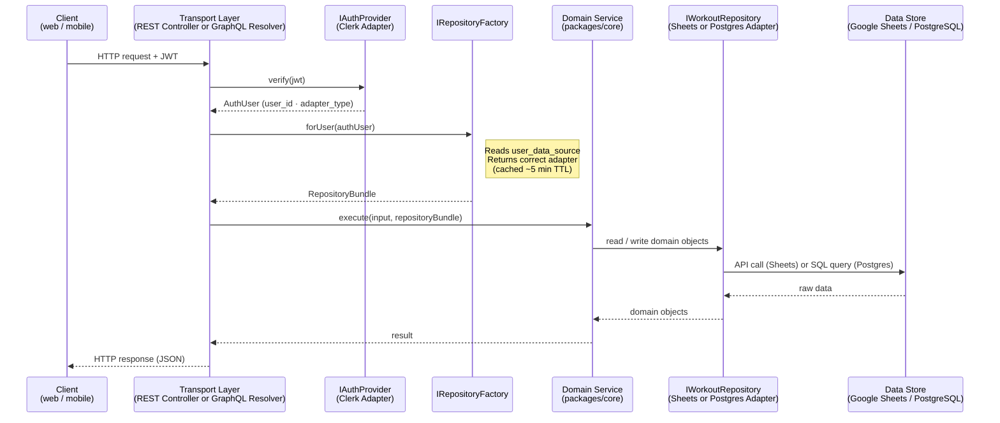

# Data Flow — Request Path

A single request from a client through the full stack: transport authentication,
per-user adapter resolution, domain logic execution, and persistence.

**Key points:**
- The transport layer never contains business logic — it authenticates, resolves adapters, and delegates.
- The domain service (`packages/core`) is unaware of which adapter is in use; it interacts only with port interfaces.
- Adapter selection is per-user, per-request, enabling different users to be on different data stores simultaneously (Sheets vs. Postgres).
- REST and GraphQL share the same service call path — only the transport wrapper differs.

**See also:** [ADR-003: Per-User Data Store Configuration](../adr/ADR-003-per-user-data-store-config.md) ·
[ADR-004: Multi-Data-Store Adapter Strategy](../adr/ADR-004-multi-data-store-adapters.md) ·
[ADR-006: Dual Transport Layer](../adr/ADR-006-rest-and-graphql-dual-transport.md)
