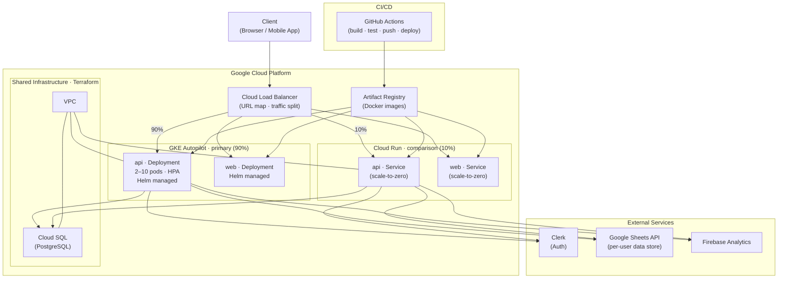

# Deployment Topology

GKE Autopilot is the primary deployment target. Cloud Run runs the same container image
as a secondary target for A/B infrastructure comparison. A Cloud Load Balancer splits
traffic between them. Shared infrastructure (VPC, Cloud SQL, Artifact Registry) is
provisioned by Terraform and consumed by both targets.

**Traffic split** is adjusted via Terraform without redeployment. Initial ratio: 90% GKE / 10%
Cloud Run. Metrics captured for comparison: request latency (p50/p95/p99), cold start
frequency, cost per request, and scale-out time under load.

**See also:** [ADR-009: Infrastructure — GKE Autopilot Primary, Cloud Run Comparison](../adr/ADR-009-infrastructure-kubernetes-cloud-run.md)
