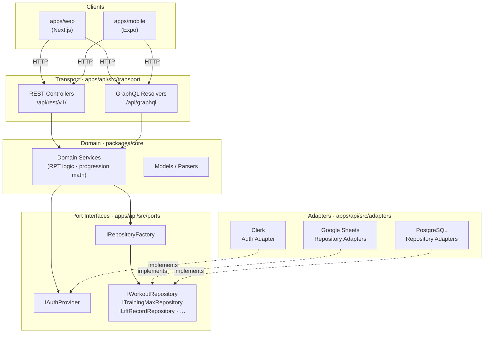

# Hexagonal Architecture (Ports and Adapters)

`packages/core` contains pure domain logic with zero infrastructure dependencies. All
external concerns — data storage, authentication, transport — are accessed through port
interfaces and implemented as swappable adapters.

**Dependency rule:** source-code dependencies point inward. Transport and adapters depend
on ports and core. Core depends on nothing outside itself.

Solid arrows = call / depend on. Dashed arrows = implements.

**See also:** [ADR-002: Hexagonal Architecture](../adr/ADR-002-ports-and-adapters.md) ·
[ADR-003: Per-User Data Store Configuration](../adr/ADR-003-per-user-data-store-config.md) ·
[ADR-006: Dual Transport Layer](../adr/ADR-006-rest-and-graphql-dual-transport.md)
