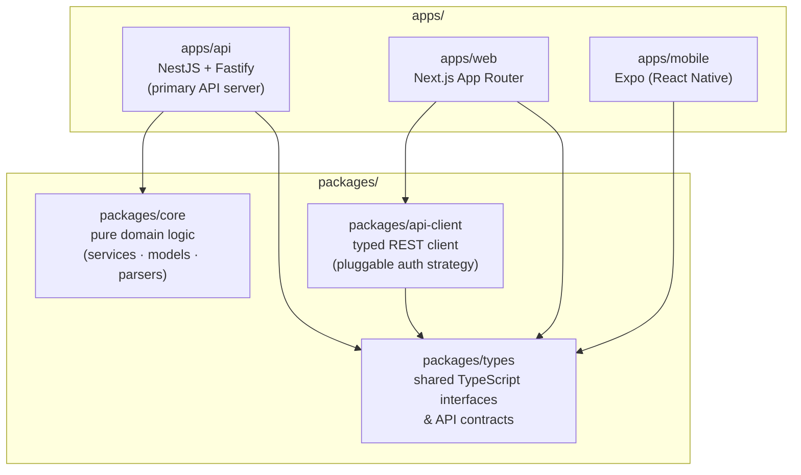

# Monorepo Package Dependency Graph

Arrows indicate compile-time dependencies (`package.json` workspace references).
`packages/core` and `packages/types` have no local dependencies — they are the
foundation the rest of the monorepo builds on.

`apps/web` and `apps/mobile` depend on `packages/types` for shared API contracts
(request/response shapes) but not on `packages/core` — domain logic runs server-side only.
`packages/api-client` is the single typed REST client shared by the web server and browser
code (and, in future, mobile); each consumer supplies only the auth-header strategy.

**See also:** [ADR-001: Monorepo Structure with Turborepo](../adr/ADR-001-monorepo-structure.md)
